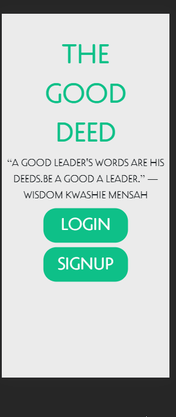

# good-deed

A full stack JavaScript application for users to commit deeds for other users.

## Technologies Used

- React.js
- Webpack 4
- PHP
- MySQL
- HTML5
- CSS3
- AWS EC2

## Live Demo

Try the application live at [https://gooddeed.uzairashraf.dev/](https://gooddeed.uzairashraf.dev/)

To login use the username ```dantheman``` with no password

ctrl + shift + i to open dev tools

preview in iPhone X for optimal viewing

## Features

- User can request deeds they need done
- User can commit deeds they find
- User can see all available deeds in their area with a 10 mile radius
- User can see their profile
- User can see their overall rating on their profile
- User can see reviews from other users on their profile
- User can mark their deed completed
- User can leave a rating for the work the other user did
- User can leave a review for the work the other user did
- User can upload a photo for their profile


## Preview




## Development

#### System Requirements

- NPM 6 or higher
- MySQL 7 or higher
- Google Maps Javascript API Key
- Google Maps Geocoding API Key

#### Getting Started

1. Clone the repository.

    ```shell
    git clone https://github.com/uzair-ashraf/good-deed.git
    cd good-deed
    ```

1. Install all dependencies with NPM.

    ```shell
    npm install
    ```

1. Import the example database to MySQL.

    ```shell
    dummy-data/good-deed.sql
    ```

1. Start the project. Once started you can view the application by opening http://localhost:3000 in your browser.

    ```shell
    npm run dev
    ```
